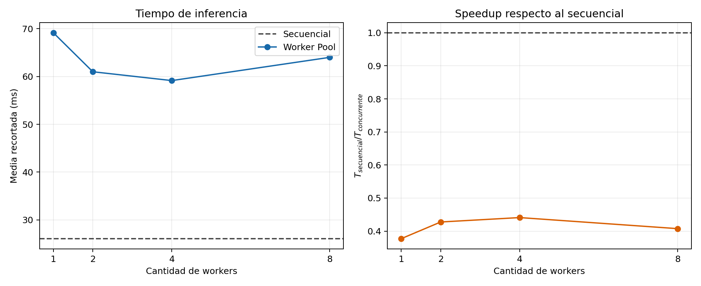

# Informe final: red neuronal y concurrencia en Go

**Curso:** Programación Concurrente y Distribuida

**Repositorio:** [PrograConcurrente2026-2](https://github.com/KarimS21/PrograConcurrente2026-2)

**Base revisada:** `f9a7181`, rama `main`, más cambios locales de Promela y documentación.

**Fecha de revisión:** 4 de octubre de 2026.

## 1. Objetivo y funcionamiento

El proyecto predice la tarifa de viajes de taxi, representada por `fare_amount`, mediante una red neuronal implementada desde cero en Go. El entrenamiento es secuencial y la inferencia se compara usando dos estrategias: un recorrido secuencial y un Worker Pool.

La red tiene nueve entradas, dos capas ocultas de 16 y 8 neuronas con activación ReLU y una salida lineal. Las entradas incluyen pasajeros, distancia, duración, códigos de tarifa y zonas, tipo de pago, hora y día de recogida. La normalización se ajusta con las muestras de entrenamiento y después se aplica a las de evaluación.

El trabajo busca comprobar que la coordinación concurrente es correcta y analizar si mejora el tiempo de ejecución. También identifica mejoras de calidad, seguridad y evaluación del modelo.

## 2. Implementación y sincronización

En la versión secuencial, `PredictSequential` recorre las muestras y guarda cada predicción. En la versión concurrente, `PredictWorkerPool` distribuye los registros entre workers:

```text
Productor --> Canal jobs --> Workers --> Canal results --> Consumidor
```

Cada trabajo lleva el índice de la muestra. El worker devuelve ese índice con la predicción, y el consumidor la guarda en su posición original. Así, aunque los trabajos terminen en distinto orden, las predicciones mantienen su correspondencia con los datos.

Los mecanismos de sincronización son:

- **Goroutines:** ejecutan los workers, el productor y el coordinador de cierre.
- **Canales:** comunican trabajos y resultados; `jobs` no tiene buffer y `results` tiene capacidad igual al número de muestras.
- **WaitGroup:** permite cerrar `results` después de que todos los workers terminen.
- **Escritor único:** solo el consumidor escribe el arreglo de predicciones.

El productor cierra `jobs` después del último envío. Los workers terminan cuando se agota ese canal y el coordinador cierra `results` al finalizar todos ellos. El consumidor recibe hasta agotar los resultados.

Los workers comparten los pesos solo para lectura. Este diseño requiere que el entrenamiento haya terminado y que las muestras no se modifiquen durante la inferencia.

## 3. Verificación formal en Spin — 4 puntos

### Modelo utilizado

El archivo [worker_pool.pml](../promela/worker_pool.pml) representa **cinco trabajos y tres workers**. Incluye productor, workers, coordinador de cierre y consumidor. Cada predicción se abstrae como el envío de un identificador; no se modela el cálculo numérico de la red.

| Elemento del modelo | Equivalente en Go |
|---|---|
| Canal `jobs` de capacidad cero | Canal de trabajos sin buffer. |
| Canal `results` de capacidad `JOBS` | Canal de resultados con capacidad igual al total de muestras. |
| `jobsClosed` y `resultsClosed` | Cierre de los canales, representado con banderas. |
| `workersDone` | Finalización coordinada mediante `WaitGroup`. |
| `completed[job]` | Registro de un resultado en su posición original. |

### Ausencia de deadlocks

Un deadlock ocurre cuando los procesos quedan bloqueados y no existe una transición que permita continuar. La comprobación de safety busca estados finales inválidos y violaciones de las aserciones.

Se ejecutó el verificador con `-q`, que exige canales vacíos en los estados finales válidos, y `-b`, que reporta como error exceder el límite de profundidad. La interpretación de estas opciones se basa en la [documentación oficial de Pan](https://spinroot.com/spin/Man/Pan.html).

### Exclusión mutua

La región de escritura está en el consumidor:

```promela
writers++;
assert(writers == 1);
assert(!completed[job]);
completed[job] = true;
completedCount++;
assert(completedCount <= JOBS);
writers--;
```

`writers` representa la cantidad de escritores activos. La aserción comprueba que exista uno durante la actualización. La exclusión de escritura se consigue por diseño: solo un proceso modifica los resultados. No se está verificando un mutex entre varios escritores.

También se comprueba que cada índice sea válido, que ningún trabajo se complete dos veces y que todos los resultados estén registrados al terminar. La escritura no está encerrada en `atomic`; ese mecanismo solo se usa para abstraer la actualización sincronizada del contador de workers.

### Finalización de los trabajos

Se verificó la propiedad:

```promela
ltl all_jobs_complete { <> (completedCount == JOBS && resultsClosed) }
```

El operador `<>` significa “eventualmente”: todos los resultados deben recibirse y el canal de resultados debe cerrarse. Su significado se recoge en la [documentación oficial de LTL de Spin](https://spinroot.com/spin/Man/ltl.html).

### Resultados y explicación

La verificación se repitió el 4 de octubre de 2026 con **Spin 6.5.2 y GCC 13.3.0 en Ubuntu mediante WSL**.

| Comprobación | Estados almacenados | Transiciones | Errores |
|---|---:|---:|---:|
| Safety: deadlocks y aserciones | 1.160.528 | 3.129.399 | 0 |
| LTL: finalización de trabajos | 1.158.256 | 7.411.485 | 0 |

Las dos búsquedas finalizaron sin exceder el límite de profundidad. Las salidas completas están en [spin-safety.txt](../results/spin-safety.txt), [spin-ltl.txt](../results/spin-ltl.txt) y [spin-environment.txt](../results/spin-environment.txt), que registra versiones y hash del modelo.

**Interpretación:** no se encontraron deadlocks ni violaciones de exclusión de escritura en el modelo analizado. Tampoco se encontraron contraejemplos a la finalización de los trabajos. Los deadlocks se verifican en safety; la búsqueda LTL tiene desactivada la comprobación de estados finales inválidos.

Estos resultados cubren el protocolo finito modelado. No demuestran la exactitud de las predicciones ni ausencia de carreras en cualquier ejecución Go. Se supone que el cálculo de cada predicción termina.

Para repetir la comprobación desde la raíz del repositorio en Linux o WSL:

```sh
sh scripts/verify_spin.sh
```

El script necesita GCC y Spin. Si Spin no está disponible, obtiene una copia temporal del paquete en Ubuntu/Debian sin instalarla en el sistema. Los comandos principales que ejecuta son:

```sh
spin -a /ruta/al/proyecto/promela/worker_pool.pml
gcc -O2 -DNOCLAIM -DSAFETY -o pan-safety pan.c
./pan-safety -b -q
gcc -O2 -o pan-ltl pan.c
./pan-ltl -a -b
```

## 4. Resultados de rendimiento

Se recalcularon las estadísticas de [inference_runs.csv](../results/inference_runs.csv). **No se repitió el benchmark** durante esta revisión. La configuración descrita en la documentación existente usa 100.000 filas, 10.000 para entrenamiento, 90.000 para evaluación, una época y semilla 42.

Hay 11 mediciones por modalidad. Se eliminan los dos tiempos menores y los dos mayores para obtener una media recortada con siete observaciones. El speedup se calcula como:

```text
Speedup = tiempo secuencial / tiempo concurrente
```

| Modalidad | Workers | Media recortada (ms) | Desv. estándar (ms) | Speedup |
|---|---:|---:|---:|---:|
| Secuencial | 0 | 26,083 | 0,191 | 1,000 |
| Worker Pool | 1 | 69,143 | 0,833 | 0,377 |
| Worker Pool | 2 | 60,986 | 0,791 | 0,428 |
| Worker Pool | 4 | 59,143 | 1,641 | 0,441 |
| Worker Pool | 8 | 63,999 | 1,308 | 0,408 |

El mejor resultado concurrente fue con cuatro workers. Sin embargo, su speedup de 0,441 indica que tardó aproximadamente **2,27 veces más** que la versión secuencial.

Una explicación probable es que cada predicción hace poco cálculo y el coste de canales y planificación supera el ahorro del paralelismo. Esta causa debe confirmarse con un perfil de CPU. Probar trabajos por lotes permitiría reducir la cantidad de intercambios por canal.



### Recursos y calidad predictiva

Los máximos guardados en [resource_runs.csv](../results/resource_runs.csv) son:

| Workers | CPU máxima del proceso (%) | Working set máximo (MiB) | Heap máximo (MiB) | Goroutines máximas |
|---|---:|---:|---:|---:|
| 1 | 14,61 | 46,05 | 36,48 | 5 |
| 2 | 19,32 | 46,14 | 36,48 | 6 |
| 4 | 22,72 | 46,48 | 36,50 | 8 |
| 8 | 22,61 | 46,52 | 36,52 | 12 |

Las cifras de CPU y working set corresponden al proceso completo, que incluye carga, entrenamiento e inferencias. No permiten atribuir el consumo exclusivamente al Worker Pool. El aumento de goroutines evidencia concurrencia, pero no demuestra por sí solo ejecución simultánea en varios núcleos.

El CSV de tiempos registra MAE = **19,1560** y MSE = **711,4134** en todas las modalidades. La igualdad de estas métricas es coherente con usar la misma red, pero no acredita por sí sola igualdad de cada predicción. Existe una prueba que compara las predicciones por índice; su ejecución está pendiente.

El MAE representa el error absoluto medio y el MSE penaliza más los errores grandes. Sin una predicción de referencia no se puede concluir que esos valores indiquen buena precisión.

Además, el CSV de tiempos guardado no contiene las columnas de monitoreo que escribe el experimentador actual. Debe conservarse como evidencia histórica y repetirse la medición con la versión actual para establecer una correspondencia completa entre código y resultados.

## 5. Análisis asistido por IA e informe de GAPs — 5 puntos

**Herramienta seleccionada: GitHub Copilot Chat en VS Code.**

El [prompt estructurado](ai-code-review-prompt.md) solicita revisar calidad, seguridad, concurrencia, datos y rendimiento. El [informe de GAPs](gap-analysis.md) presenta hallazgos con ubicación, evidencia, impacto y recomendación.

Los hallazgos principales son:

- Falta de rechazo de `NaN`, infinitos y fechas incoherentes en el lector CSV.
- Diferencias de validación entre las funciones secuencial y concurrente.
- Pruebas que dependen de un CSV excluido del repositorio.
- Necesidad de documentar que entrenamiento e inferencia no deben ejecutarse simultáneamente sobre la misma red.
- Medición de recursos que incluye el proceso completo e instrumentación.
- Variables categóricas tratadas como continuas y ausencia de una predicción de referencia.

Se reconocen también controles correctos: cierre coordinado de canales, escritor único, resultados indexados y normalización ajustada con el conjunto de entrenamiento.

La revisión debe contrastarse con el código: el uso de canales no garantiza mayor velocidad, una ruta local de archivo no demuestra una vulnerabilidad y los resultados de Spin no cubren toda la implementación Go. Falta adjuntar una captura o exportación de la interacción con la herramienta seleccionada para acreditar este criterio.

## 6. Conclusiones y recomendaciones del alumno — 4 puntos

### Conclusiones

1. **La concurrencia no garantiza mayor velocidad.** En las mediciones guardadas, la versión secuencial fue más rápida. Consideramos que la cantidad de workers debe elegirse según el coste de cada tarea y las mediciones del equipo.
2. **La coordinación es parte central de la solución.** Conservar los índices, cerrar los canales en orden y tener un único escritor permite recibir resultados sin perder su correspondencia con los registros.
3. **La verificación formal aporta evidencia concreta.** Spin no encontró deadlocks ni violaciones de las aserciones en el modelo. Entendemos que esta conclusión tiene un alcance limitado y debe complementarse con pruebas de Go.
4. **La calidad del modelo y la eficiencia son objetivos distintos.** Reducir tiempos no demuestra que la red prediga mejor. Hace falta comparar el error con una solución de referencia.
5. **La entrega necesita trazabilidad.** Los resultados deben acompañarse de comandos, versiones y participación verificable de los integrantes.

### Recomendaciones

Proponemos priorizar la validación de datos y las pruebas reproducibles antes de optimizar el Worker Pool. Después, mediríamos tiempos y recursos por separado y compararíamos trabajos individuales contra lotes.

Para mejorar el modelo predictivo, compararíamos una codificación categórica y una predicción basada en la media de las tarifas de entrenamiento. También completaríamos la evidencia de la interacción con IA y registraríamos las siguientes contribuciones mediante ramas y PR.

Estas conclusiones son una propuesta de redacción para que el equipo las revise y pueda defenderlas con sus propias palabras.

## 7. Sustentación del informe y anexos — 5 puntos

La exposición debe explicar el problema, el diseño concurrente, las propiedades verificadas y lo que realmente muestran los resultados. Se propone una duración de ocho a diez minutos, ajustable al tiempo indicado por el docente.

La [guía de sustentación](anexos.md) incluye un orden de exposición, demostraciones y preguntas esperables. Durante la presentación se mostrarán el modelo Promela, las salidas de Spin, la tabla de rendimiento, tres GAPs prioritarios y el historial del repositorio.

La grabación o enlace de sustentación queda pendiente. Tener un guion no sustituye la exposición ni su evidencia.

## 8. Historial Gitflow y participación — 2 puntos

El equipo está integrado por **Juan Diego Adrián Sánchez Sánchez, Karim Wagner Samanamud Mosquera y Tomas Alonso Pastor Salazar**. La presentación de la participación considera el desarrollo, las pruebas, la documentación, la revisión y la sustentación. El número de commits, por sí solo, no describe toda la colaboración académica.

El historial permite seguir los principales cambios del proyecto:

| Commit | Cambio registrado |
|---|---|
| `08f851f` | Inicio del repositorio. |
| `e9cd116` y `1616a82` | Incorporación del README e integración mediante PR. |
| `a41a60e` | Implementación y contenido del entregable PC2. |
| `f9a7181` | Documentación del entregable de la semana 7. |

El registro disponible muestra la rama `main` y una integración mediante PR. Para completar la documentación de Gitflow, se adjuntarán los enlaces a las ramas de trabajo, los PR y la integración de la entrega.

El [anexo de Git](anexos.md#anexo-d-historial-y-participación) reúne los comandos y el registro del repositorio, junto con una tabla común para documentar los aportes del equipo. Esta evidencia se presenta como parte del trabajo grupal, sin establecer comparaciones de participación a partir del conteo de commits.

## 9. Anexos, reproducibilidad y pendientes

| Anexo | Contenido |
|---|---|
| A | [Modelo Promela](../promela/worker_pool.pml), [script de verificación](../scripts/verify_spin.sh) y [salidas de Spin](../results/spin-safety.txt). |
| B | [Prompt de IA](ai-code-review-prompt.md) e [informe de GAPs](gap-analysis.md). Falta la captura o exportación de la interacción. |
| C | [Tiempos](../results/inference_runs.csv), [recursos](../results/resource_runs.csv) y [gráfico](../results/inference_speedup.png). |
| D | [Registro del historial](../results/git-history.txt) y [guía para evidenciar Gitflow](anexos.md#anexo-d-historial-y-participación). |
| E | [Guion y preguntas de sustentación](anexos.md#anexo-e-guía-de-sustentación). Falta la grabación o su enlace. |

Para preparar el dataset se puede ejecutar el notebook `TrabajoParcial.ipynb`, que requiere pandas y un motor Parquet. También se puede exportar el Parquet procesado existente desde la raíz del proyecto:

```powershell
python -c "import pandas as pd; pd.read_parquet('processed/yellow_tripdata_2026-01.parquet').to_csv('processed/yellow_tripdata_2026-01.csv', index=False)"
```

Una vez que Go esté disponible, ejecutar:

```powershell
go test -count=1 ./...
go vet ./...
go test -race -count=1 ./...
go run ./cmd/experiment -max-rows 100000 -train-rows 10000 -epochs 1 -workers 1,2,4,8 -runs 11 -trim 0.2 -output results/inference_runs.csv
```

El detector de carreras requiere un entorno compatible con cgo y compilador C. Durante esta revisión Windows bloqueó `go.exe` por una directiva de control de aplicaciones; no se presentan las pruebas como aprobadas.

Para cerrar la entrega se deben adjuntar las comprobaciones Go, la evidencia de la conversación con IA, la sustentación y los anexos del trabajo colaborativo y del flujo Git.
